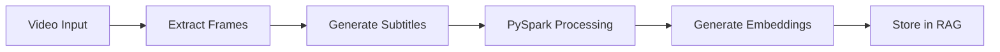

# StreamScribe AI - Final Project Plan

## Project Overview
StreamScribe AI is an academic project that provides real-time video analysis with subtitle generation and interactive chatbot capabilities. The system processes YouTube videos, generates insights, and allows users to interact with video content through a RAG-powered chatbot.

## Core Technologies
- **Backend**: Python, AWS (S3, Lambda)
- **Data Processing**: PySpark for subtitle encoding and RAG preparation
- **AI/ML**: OpenAI API for frame analysis and RAG
- **Frontend**: Streamlit for interactive UI
- **Storage**: Amazon S3 for video and processed data

## Key Features

### 1. Video Processing
- YouTube video playback and processing
- Custom video upload support (up to 500MB+)
- Real-time subtitle generation
- Key frame identification and analysis
- Session persistence for resumed processing

### 2. Data Processing Pipeline


### 3. Interactive UI (Streamlit)
```python
def main():
    st.title("StreamScribe AI")
    
    # Session State Management
    if 'chat_history' not in st.session_state:
        st.session_state.chat_history = []
    
    # Video Input Section
    video_source = st.radio("Choose video source:", ["YouTube URL", "Upload"])
    if video_source == "YouTube URL":
        url = st.text_input("Enter YouTube URL")
        if url:
            st.video(url)
    else:
        video_file = st.file_uploader("Upload video", type=['mp4'])
        if video_file:
            st.video(video_file)
    
    # Processing Section
    if st.button("Process Video"):
        with st.spinner("Processing..."):
            results = process_video(url or video_file)
            st.session_state.current_results = results
    
    # Chat Interface
    if 'current_results' in st.session_state:
        user_question = st.text_input("Ask about the video:")
        if user_question:
            response = generate_response(user_question, 
                                        st.session_state.current_results)
            st.session_state.chat_history.append((user_question, response))
    
    # Display Chat History
    if st.session_state.chat_history:
        st.subheader("Chat History")
        for q, a in st.session_state.chat_history:
            st.write(f"Q: {q}")
            st.write(f"A: {a}")
```

### 4. RAG Implementation
- PySpark-generated encodings for efficient retrieval
- Context-aware responses using video content
- Persistent chat history within sessions

## Technical Implementation Details

### 1. Data Collection & Storage
```python
def process_and_store_video(video_source):
    # Extract video ID or process uploaded file
    video_data = extract_video(video_source)
    
    # Store in S3
    s3_path = store_in_s3(video_data)
    
    # Generate unique session ID
    session_id = generate_session_id()
    
    return session_id, s3_path
```

### 2. PySpark Processing
```python
from pyspark.sql import SparkSession

def process_subtitles(subtitles):
    spark = SparkSession.builder.appName("StreamScribe").getOrCreate()
    
    # Convert subtitles to Spark DataFrame
    subtitle_df = spark.createDataFrame(subtitles, ["timestamp", "text"])
    
    # Generate embeddings
    embed_udf = udf(lambda x: generate_embedding(x), ArrayType(FloatType()))
    encoded_df = subtitle_df.withColumn("embedding", embed_udf("text"))
    
    return encoded_df
```

### 3. Session Management
```python
class VideoSession:
    def __init__(self, session_id):
        self.session_id = session_id
        self.chat_history = []
        self.video_data = None
        self.embeddings = None
    
    def add_chat(self, question, answer):
        self.chat_history.append({
            "question": question,
            "answer": answer,
            "timestamp": datetime.now()
        })
    
    def save_to_s3(self):
        # Save session data to S3
        pass
    
    @classmethod
    def load_from_s3(cls, session_id):
        # Load session data from S3
        pass
```

## Implementation Timeline

1. **Week 1-2: Core Infrastructure**
   - Set up AWS services
   - Implement video processing pipeline
   - Create basic Streamlit UI

2. **Week 3-4: RAG Implementation**
   - Develop PySpark encoding generation
   - Implement RAG model
   - Create chat interface

3. **Week 5-6: UI Enhancement & Testing**
   - Implement session persistence
   - Add video playback and chat history
   - Perform comprehensive testing

4. **Week 7-8: Optimization & Documentation**
   - Optimize performance
   - Create presentation materials
   - Prepare final documentation

## Academic Requirements Alignment

1. **Data Collection** ✅
   - Direct S3 upload
   - API-based YouTube data fetch

2. **Data Processing** ✅
   - PySpark implementation for encoding generation
   - Processed data stored in S3

3. **Model Development** ✅
   - LLM-based model using OpenAI API
   - RAG implementation for context-aware responses

4. **Testing** ✅
   - Real-time processing serves as continuous testing
   - Session history for result verification

5. **Final Demo** ✅
   - Streamlit UI with all required components
   - 500MB+ upload support
   - Data visualization and statistics

## Potential Challenges & Solutions

1. **Large File Processing**
   - Solution: Implement chunked processing
   - Use S3 multipart upload for large files

2. **Real-Time Performance**
   - Solution: Caching frequently accessed data
   - Implement background processing where possible

3. **Session Management**
   - Solution: Use S3 for persistent storage
   - Implement efficient session retrieval

## Questions for Team Discussion
1. Should we implement user authentication?
2. Do we need to limit session storage duration?
3. Should we add export functionality for processed results?

Would you like me to:
1. Provide more detailed code for any section?
2. Create a visual mockup of the Streamlit UI?
3. Elaborate on any specific technical component?
4. Discuss testing strategies in more detail?