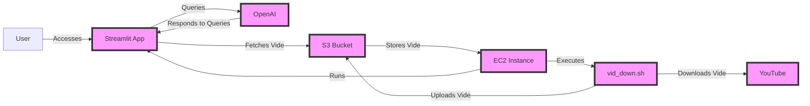

### Project Summary

**Project Name:** StreamScribe  
**Overview:**  
StreamScribe is a project designed to stream videos from an Amazon S3 bucket and provide a chat interface for users to interact with video content. The project utilizes Streamlit for the web interface, OpenAI for chat functionality, and AWS services for infrastructure.

**Key Components:**

1. **Infrastructure (AWS):**
   - **VPC:** A virtual private cloud with public and private subnets.
   - **Security Group:** Allows inbound traffic on ports 22 (SSH) and 8080 (Streamlit app).
   - **S3 Bucket:** Stores video files and subtitles.
   - **EC2 Instance:** Runs the Streamlit application and handles video downloads.
   - **IAM Role and Policy:** Grants access to S3 resources for the EC2 instance.

2. **Streamlit Application:**
   - **Video Streaming:** Displays videos from S3 using pre-signed URLs.
   - **Chat Interface:** Uses OpenAI to process user queries about video content.
   - **Subtitles:** Fetches and displays subtitles for selected videos.

3. **Automation and Deployment:**
   - **Terraform:** Manages infrastructure provisioning.
   - **User Data Script:** Installs necessary packages and sets up the environment on the EC2 instance.
   - **Systemd Service (`streamscribe.service`):** Ensures the Streamlit app runs continuously.

4. **Video Download Script (`vid_down.sh`):**
   - **Functionality:** Downloads YouTube videos in multiple formats (merged video, best quality video+audio, audio-only, thumbnail, subtitles, and metadata) using `yt-dlp`.
   - **Uploads:** All downloaded files are uploaded to the S3 bucket.
   - **CSV Update:** Updates a CSV file with S3 object keys and local file paths.

**Architecture Diagram:**

**Functionality:**

- Users can select a video from a list and view it with subtitles.
- Users can ask questions about the video content through a chat interface.
- The system uses AI to respond to user queries based on video context.

**Security and Access:**

- SSH access to the EC2 instance is secured with a private key.
- The S3 bucket is accessible only through pre-signed URLs generated by the application.

**Future Enhancements:**

- Improve AI model integration for more accurate responses.
- Add support for multiple video formats and sources.
- Enhance security by limiting access to specific IP ranges.
- Integrate more advanced video processing capabilities in the `vid_down.sh` script.